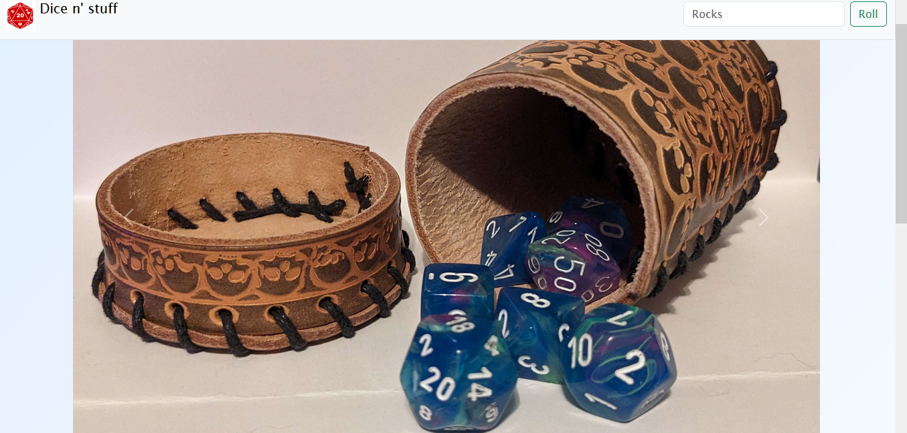
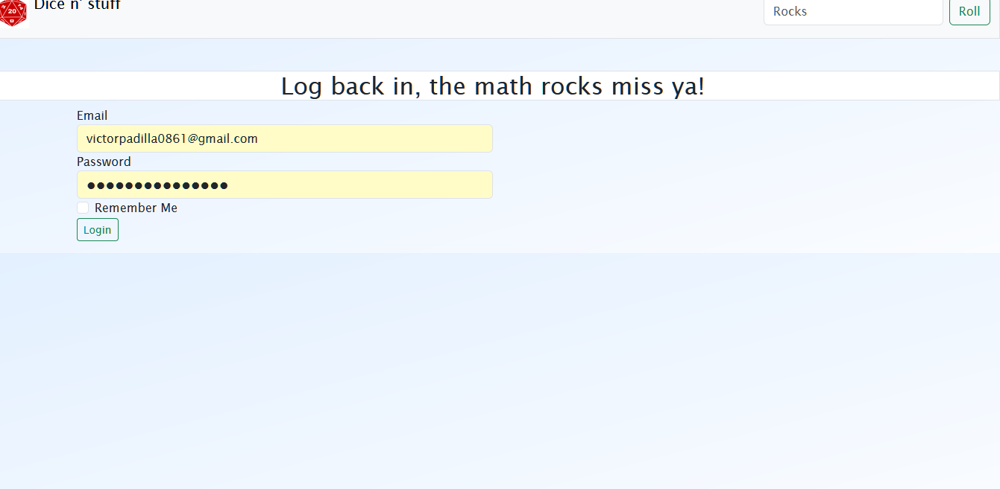
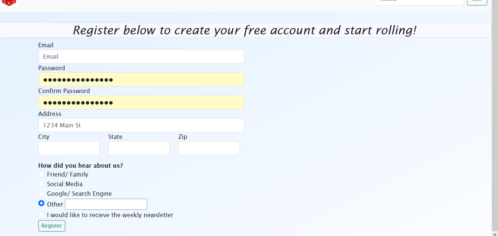
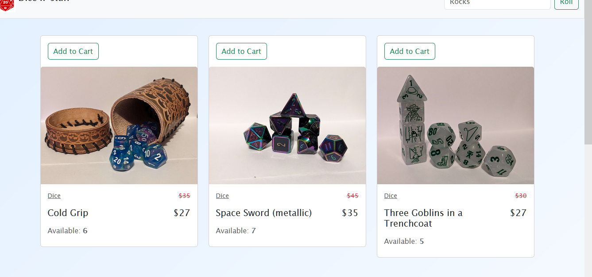
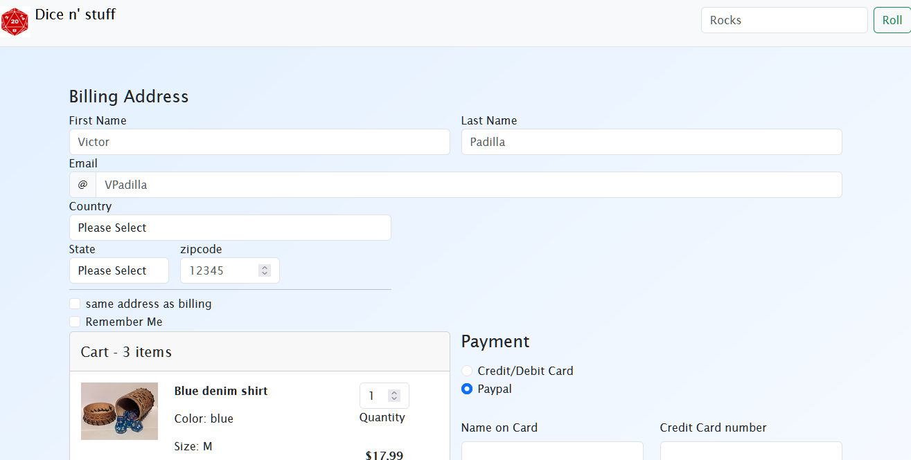

# Dice'n Stuff
 capstone-project

## Description

A five page e-commerce website including a homepage, a login page, a registration page, a products page, and a shopping cart page- [Github Project Location](https://github.com/VictorPadilla0861/CapstoneProject)

## Page 1
A homepage with a carousel of products listed and a footer
### page-image

## Page 2
A login page that directs you back to the homepage
### page-image

## Page 3
A registration page with fillable form and dropdown selectors
### page-image

## Page 4
A products page with a row of cards displaying products
### page-image

## Page 5
A shopping cart page with payment fields and 
### page-image
